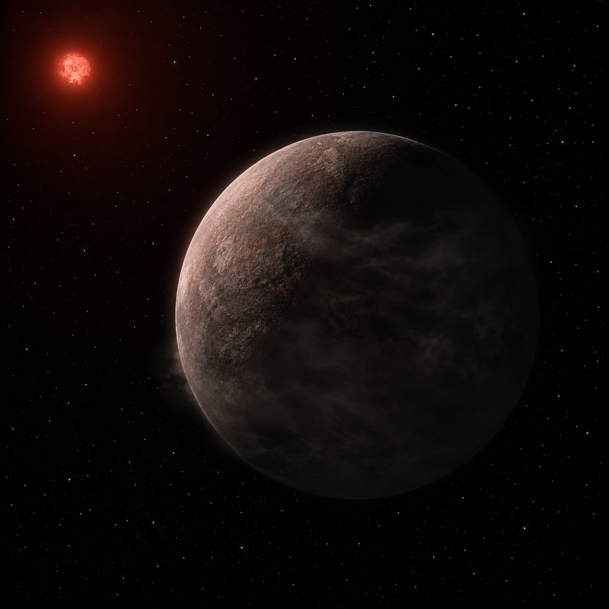

# LHS 475b — Exoplanet Atmosphere Report

<p align="center">
  
</p>

<p align="center"><em>AI-generated artist's concept — not a real photograph. See the report for actual JWST NIRSpec data.</em></p>

An Earth-sized rocky planet interior to its M-dwarf's habitable zone,
and one of JWST's first terrestrial-exoplanet targets. This repo tests
the published transmission spectrum against candidate atmosphere
models with an explicit chi-squared, degrees-of-freedom, and p-value
comparison, and is clear about what that comparison can and can't
rule out.

**[Open the full report](https://biswajit1999.github.io/lhs-475b-exoplanet-report/)** — the live GitHub Pages version. You can also open `index.html` locally in a browser, or serve it with `python -m http.server` from this directory.

## Data sources

- **System parameters** — from the NASA Exoplanet Archive TAP
  service (`pscomppars`).
- **JWST transmission spectrum and atmosphere models** — five files
  from Zenodo record [7925111](https://zenodo.org/records/7925111)
  (Lustig-Yaeger & Fu et al. 2023, *Nature Astronomy*): the 56-point
  co-added NIRSpec/G395H spectrum (FIREFLy pipeline reduction), plus four
  published forward-model spectra (pure methane, 1x-solar
  hydrogen-rich, clear Venus-like CO2, pure CO2), each already offset
  to the measured depth by the upstream Zenodo release.
- **Analysis** — `scripts/analyze_spectrum.py` fits a flat (featureless)
  line to the spectrum and computes chi-squared, degrees of freedom,
  reduced chi-squared, and a survival-function p-value
  (`scipy.stats.chi2.sf`) of the data against each candidate model.
  Run it yourself:

  ```bash
  pip install -r requirements.txt
  python scripts/analyze_spectrum.py
  ```

## Repository structure

```text
index.html              the report webpage
data/                    JWST NIRSpec spectrum + atmosphere models (Zenodo 7925111)
scripts/analyze_spectrum.py   flat-line and model reduced-chi-squared analysis
figures/                 generated plot + summary_statistics.csv
tests/                   unit tests + a regression check against the real data
```

## Tests

`tests/test_analysis.py` checks the ECSV loader and the chi-squared/
p-value formula against a known analytic case, and reruns the full
pipeline on the real downloaded spectrum and models, verifying it
still reproduces the documented p-values — including that the
hydrogen-rich and methane models stay disfavored while the CO2 models
stay statistically consistent. Runs automatically on every push via
GitHub Actions; run locally with:

```bash
pytest tests/ -v
```

## What the numbers show

| Test | χ² / dof | reduced χ² | p-value |
|---|---|---|---|
| Flat line | 50.70 / 55 | 0.92 | 0.640 |
| Pure CH4 (methane) | 128.69 / 56 | 2.30 | 1.2×10⁻⁷ — disfavored |
| 1x-solar H2-rich | 11541.08 / 56 | 206.1 | <10⁻³⁰⁰ — decisively disfavored |
| Clear Venus-like (CO2) | 62.90 / 56 | 1.12 | 0.245 — consistent |
| Pure CO2 | 57.58 / 56 | 1.03 | 0.416 — consistent |

The spectrum is statistically indistinguishable from a flat line
(chi-squared of 50.70 over 55 degrees of freedom, p = 0.640). A
primordial hydrogen-dominated envelope is decisively rejected, and a
cloudless pure-methane atmosphere is disfavored at high confidence
(p = 1.2×10⁻⁷), while denser, higher-mean-molecular-weight options
like a CO2-dominated, Venus-like atmosphere remain statistically
consistent with the data (p = 0.245 and 0.416) — matching the
published conclusion that the data cannot yet distinguish a thick CO2
atmosphere, a thin Mars-like one, or bare rock.

## Limitations

The model-comparison p-values assume each candidate model is fixed
with no locally fit free parameters — the models were already offset
to the measured depth upstream, in the original Zenodo release — so
dof = N for those comparisons, while the flat-line fit fits one free
parameter locally and uses dof = N-1. This repo also compares only 4
of the paper's roughly 12 candidate models (a representative disfavored
pair and a representative consistent pair). A "consistent" p-value
means the data cannot rule the model out — not that it confirms it; a
genuinely featureless spectrum is equally consistent with several very
different atmospheres, or none at all. Separately: the raw data file
reports transit depth in percent while the model files are fractional
— this repo's script converts both to the same scale explicitly (see
the comment in `scripts/analyze_spectrum.py`) rather than silently
assuming a match.

## References

1. Lustig-Yaeger, J. & Fu, G. et al., 2023. A JWST transmission spectrum
   of the nearby Earth-sized exoplanet LHS 475 b. *Nature Astronomy*, 7,
   pp.1317-1328.
2. Ment, K. et al., 2023. LHS 475 b: A Venus-sized Planet Orbiting a
   Nearby M Dwarf. *The Astronomical Journal* (submitted),
   arXiv:2304.01920.
3. NASA Exoplanet Archive, <https://exoplanetarchive.ipac.caltech.edu/>.
4. Zenodo record 7925111, <https://zenodo.org/records/7925111>.

## Author

Biswajit Jana — [Portfolio](https://biswajit1999.github.io/Biswajit_Jana.github.io/) · [GitHub](https://github.com/Biswajit1999) · [LinkedIn](https://www.linkedin.com/in/biswajit-jana-27011a151/) · [ORCID](https://orcid.org/0009-0002-2411-1891)
