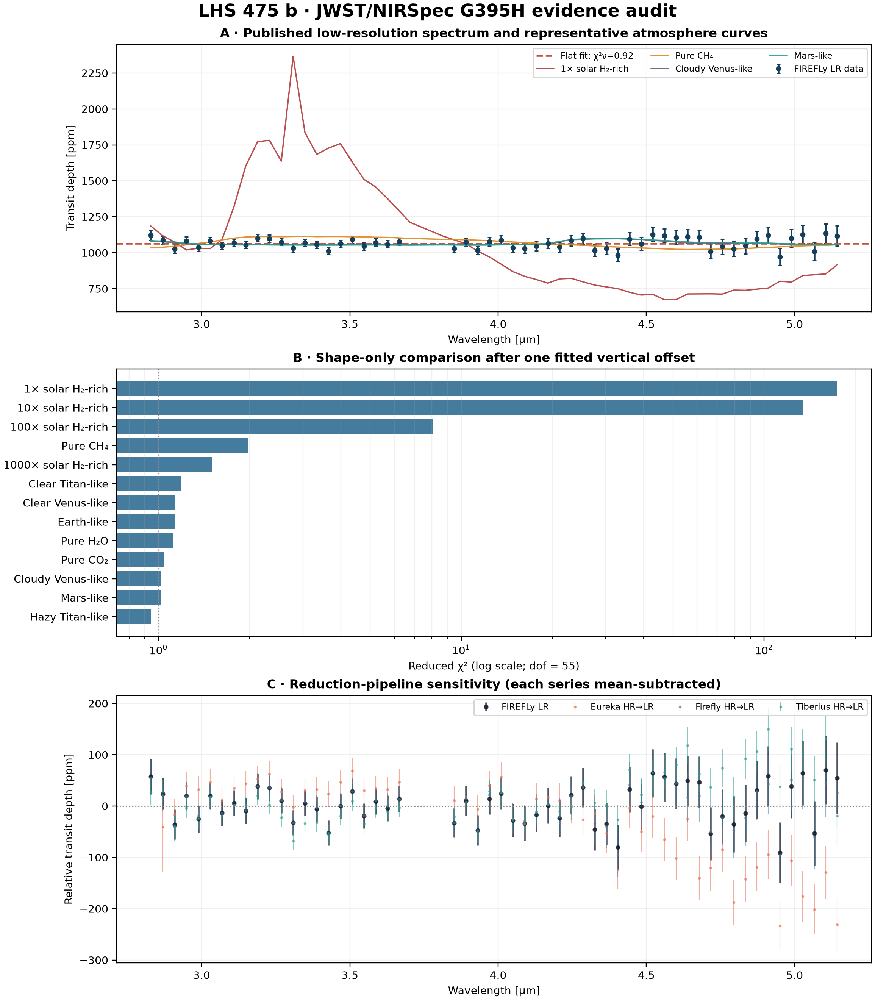

# LHS 475 b — JWST atmosphere constraints

**Independent reproducibility report by [Biswajit Jana](https://biswajit1999.github.io/Biswajit_Jana.github.io/)** · [Live report](https://biswajit1999.github.io/lhs-475b-exoplanet-report/) · [ORCID](https://orcid.org/0009-0002-2411-1891)

This repository reproduces and extends a focused part of the analysis behind
the first JWST transmission spectrum of the Earth-sized planet LHS 475 b. It
uses the complete public Zenodo model set and three independently developed
reductions of the same two NIRSpec/G395H transits. The published paper remains
the authoritative scientific interpretation.

## Scientific question

Which broad classes of atmosphere are incompatible with the observed spectral
shape, and how sensitive is that conclusion to the reduction pipeline?

The 56-bin FIREFLy spectrum accepts a fitted constant: χ² = 50.70 for 55
degrees of freedom (p = 0.640). This is a failure to reject a flat spectrum,
not evidence that the planet is airless. The public products leave compact,
high-mean-molecular-weight, cloudy, and no-atmosphere interpretations
degenerate. Conversely, low-metallicity hydrogen-rich models have spectral
structure far larger than the data permit.

## Analysis design

All 13 released atmosphere scenarios are tested in two deliberately separate
ways:

1. **Supplied curve:** compares the data with the already offset curve in the
   archive, without fitting a local parameter (dof = 56). This reproduces the
   released representation but relies on the upstream offset convention.
2. **Shape-only:** fits one vertical offset before comparing wavelength
   structure (dof = 55). This makes the nuisance reference radius explicit.

The Eureka!, FIREFLy, and Tiberius high-resolution spectra are also
inverse-variance rebinned to the low-resolution wavelength bins. These are
different reductions of the same two visits, so their agreement measures
pipeline sensitivity rather than independent repeatability. FIREFLy HR→LR is
primarily a self-consistency check.



Machine-readable results are in
[`model_comparison.csv`](figures/model_comparison.csv),
[`pipeline_comparison.csv`](figures/pipeline_comparison.csv), and
[`analysis_summary.json`](figures/analysis_summary.json).

## Reproduce

```bash
python -m pip install -r requirements.txt
python scripts/validate_sources.py
python scripts/analyze_spectrum.py
pytest -q
ruff check .
```

`data/source_manifest.json` records normalized SHA-256 checksums for all 17
copied products and the MD5 supplied for the original Zenodo archive. No
numeric values in the source products were altered.

## Repository map

```text
data/models/                 13 released atmosphere curves
data/pipeline_spectra/       Eureka!, FIREFLy, and Tiberius HR spectra
data/source_manifest.json    file-level provenance checksums
scripts/analyze_spectrum.py  reproducible statistics and figure
scripts/validate_sources.py  source-integrity check
figures/                     plot and machine-readable results
tests/                       validation and numerical regression tests
```

## Interpretation limits

- A large goodness-of-fit p-value does not confirm an atmospheric scenario.
- These curve checks are not a retrieval, Bayes-factor calculation, or
  molecule detection test; they do not marginalize over correlated noise or
  model parameters.
- Rebinning does not make the three reductions statistically independent.
- Elevated scatter in a rebinned product can reflect covariance or formal
  error calibration and is not, by itself, evidence for an atmosphere.
- The analysis tests the archived products, not raw detector exposures.

## Data and references

- Lustig-Yaeger, J., Fu, G. et al. (2023), “A JWST transmission spectrum
  of the nearby Earth-sized exoplanet LHS 475 b,” *Nature Astronomy* 7,
  1317–1328, [arXiv:2301.04191](https://arxiv.org/abs/2301.04191).
- Public spectra and models: [Zenodo record 7925111](https://doi.org/10.5281/zenodo.7925111).
- System context: [NASA Exoplanet Archive](https://exoplanetarchive.ipac.caltech.edu/).

## Author

Biswajit Jana — [Portfolio](https://biswajit1999.github.io/Biswajit_Jana.github.io/) · [GitHub](https://github.com/Biswajit1999) · [ORCID](https://orcid.org/0009-0002-2411-1891)
